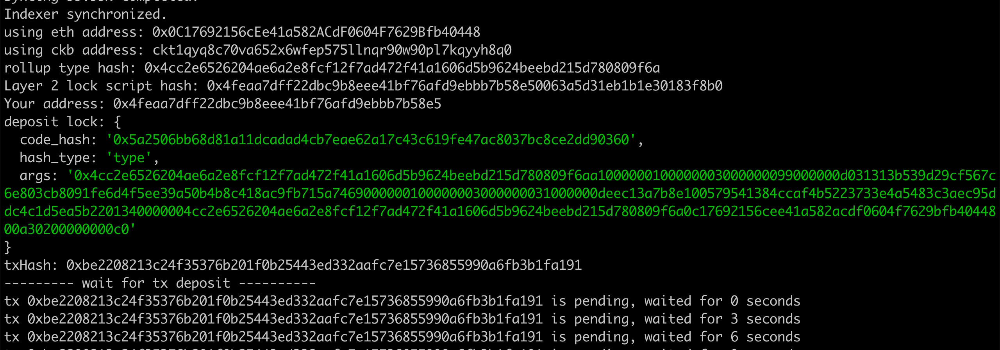

## Create A Godwoken Account On The EVM Layer 2 Testnet

### CKB Accounts
> 

### Transaction hash of layer 1 adress I funded on testnet

https://explorer.nervos.org/aggron/transaction/0xbe2208213c24f35376b201f0b25443ed332aafc7e15736855990a6fb3b1fa191

### Screenshot of the console output immediately after I successfully submitted a deposit to Layer 2

> 

```
using eth address: 0x0C17692156cEe41a582ACdF0604F7629Bfb40448
using ckb address: ckt1qyq8c70va652x6wfep575llnqr90w90pl7kqyyh8q0
rollup type hash: 0x4cc2e6526204ae6a2e8fcf12f7ad472f41a1606d5b9624beebd215d780809f6a
Layer 2 lock script hash: 0x4feaa7dff22dbc9b8eee41bf76afd9ebbb7b58e50063a5d31eb1b1e30183f8b0
Your address: 0x4feaa7dff22dbc9b8eee41bf76afd9ebbb7b58e5
deposit lock: {
  code_hash: '0x5a2506bb68d81a11dcadad4cb7eae62a17c43c619fe47ac8037bc8ce2dd90360',
  hash_type: 'type',
  args: '0x4cc2e6526204ae6a2e8fcf12f7ad472f41a1606d5b9624beebd215d780809f6aa1000000100000003000000099000000d031313b539d29cf567c6e803cb8091fe6d4f5ee39a50b4b8c418ac9fb715a7469000000100000003000000031000000deec13a7b8e100579541384ccaf4b5223733e4a5483c3aec95ddc4c1d5ea5b2201340000004cc2e6526204ae6a2e8fcf12f7ad472f41a1606d5b9624beebd215d780809f6a0c17692156cee41a582acdf0604f7629bfb4044800a30200000000c0'
}

txHash: 0xbe2208213c24f35376b201f0b25443ed332aafc7e15736855990a6fb3b1fa191

....

Your account id: 1729
ckb balance in godwoken is: 100000000000
deposit success!
```