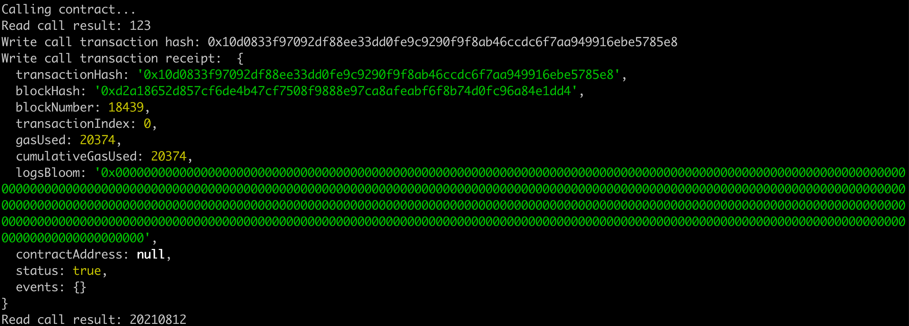

## 1.A screenshot of the console output immediately after you have successfully issued a smart contract call



## 2.The transaction hash from the console output (in text format).
`0x10d0833f97092df88ee33dd0fe9c9290f9f8ab46ccdc6f7aa949916ebe5785e8`

## 3.The contract address that you called (in text format).
`0x81D89F301aBf286686ED482eF6d83f3343a37687`

## 4.The contract address that you called (in text format).

```js
[
    {
      "inputs": [],
      "stateMutability": "payable",
      "type": "constructor"
    },
    {
      "inputs": [
        {
          "internalType": "uint256",
          "name": "x",
          "type": "uint256"
        }
      ],
      "name": "set",
      "outputs": [],
      "stateMutability": "payable",
      "type": "function"
    },
    {
      "inputs": [],
      "name": "get",
      "outputs": [
        {
          "internalType": "uint256",
          "name": "",
          "type": "uint256"
        }
      ],
      "stateMutability": "view",
      "type": "function"
    }
]
```
