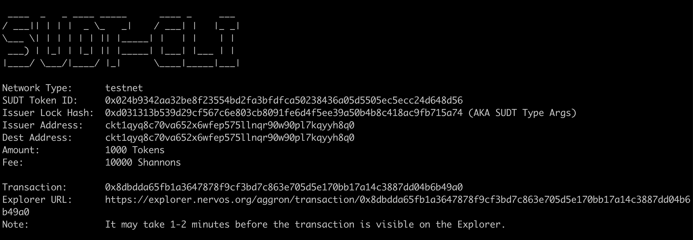

## A link to the Layer 1 address you funded on the Testnet Explorer.
https://explorer.nervos.org/aggron/address/ckt1qyq8c70va652x6wfep575llnqr90w90pl7kqyyh8q0

## A screenshot of the console output immediately after using sudt-cli to create your SUDT tokens on Layer 1.

> 

## A link to the transaction ID created by sudt-cli on the Testnet Explorer.

https://explorer.nervos.org/aggron/transaction/0x8dbdda65fb1a3647878f9cf3bd7c863e705d5e170bb17a14c3887dd04b6b49a0

## A screenshot of the console output immediately after you have successfully submitted a deposit to Layer 2 using the account-cli tool.

> 

## The SUDT ID from the console output after executing the deposit script (in text format).

SUDT ID: 1907
