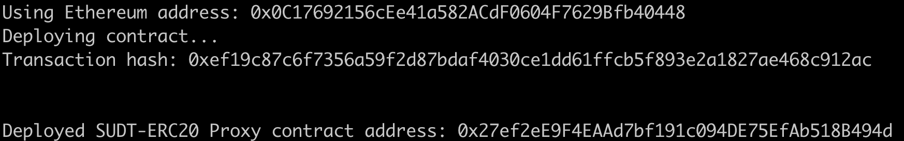
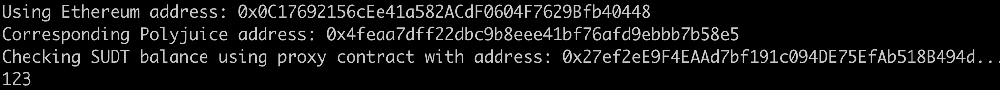

## 1. A screenshot of the console output immediately after deploying smart contract.
>

## 2. The address of the ERC20 Proxy Contract you deployed (in text format).
`0x27ef2eE9F4EAAd7bf191c094DE75EfAb518B494d`

## 3. A screenshot of the console output immediately after checking your SUDT balance.
>

## 4. The Ethereum address that was checked (in text format).

`0x0C17692156cEe41a582ACdF0604F7629Bfb40448`
