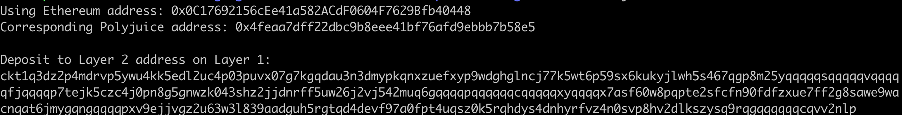

## 1.A screenshot of the console output immediately after you have successfully generated your Deposit Receiver Address.

## 2.Your Deposit Receiver Address (in text format).
`ckt1q3dz2p4mdrvp5ywu4kk5edl2uc4p03puvx07g7kgqdau3n3dmypkqnxzuefxyp9wdghglncj77k5wt6p59sx6kukyjlwh5s467qgp8m25yqqqqqsqqqqqvqqqqqfjqqqqp7tejk5czc4j0pn8g5gnwzk043shz2jjdnrff5uw26j2vj542muq6gqqqqpqqqqqqcqqqqqxyqqqqx7asf60w8pqpte2sfcfn90fdfzxue7ff2g8sawe9wacnqat6jmygqngqqqqpxv9ejjvgz2u63w3l839aadguh5rgtqd4devf97a0fpt4uqsz0k5rqhdys4dnhyrfvz4n0svp8hv2dlkszysq9rqgqqqqqqcqvv2nlp`

## 3.The Ethereum address used to generate the Deposit Receiver Address (in text format).
`0x0C17692156cEe41a582ACdF0604F7629Bfb40448`

## 4.A link to the Etherscan explorer for the successful Force Bridge transaction. This can be found on Force Bridge under History→Succeed.

https://rinkeby.etherscan.io/tx/0x0fc90225d05c9a818a632fa2025592825c5ac91424147502dde5cbe3730524c5

## 5.A link to the Nervos explorer for the successful Force bridge transaction. This can be found on Force Bridge under History→Succeed.
https://explorer.nervos.org/aggron/transaction/0x751b3a4077f0ba86f06bafbdfafa5a95f5993b0e935c4cb06294feec49e35be5

---

gw-gitcoin-instruction/src/examples/6-bridge$ node index.js
Using Ethereum address: 0x0C17692156cEe41a582ACdF0604F7629Bfb40448
Corresponding Polyjuice address: 0x4feaa7dff22dbc9b8eee41bf76afd9ebbb7b58e5

Deposit to Layer 2 address on Layer 1:
ckt1q3dz2p4mdrvp5ywu4kk5edl2uc4p03puvx07g7kgqdau3n3dmypkqnxzuefxyp9wdghglncj77k5wt6p59sx6kukyjlwh5s467qgp8m25yqqqqqsqqqqqvqqqqqfjqqqqp7tejk5czc4j0pn8g5gnwzk043shz2jjdnrff5uw26j2vj542muq6gqqqqpqqqqqqcqqqqqxyqqqqx7asf60w8pqpte2sfcfn90fdfzxue7ff2g8sawe9wacnqat6jmygqngqqqqpxv9ejjvgz2u63w3l839aadguh5rgtqd4devf97a0fpt4uqsz0k5rqhdys4dnhyrfvz4n0svp8hv2dlkszysq9rqgqqqqqqcqvv2nlp